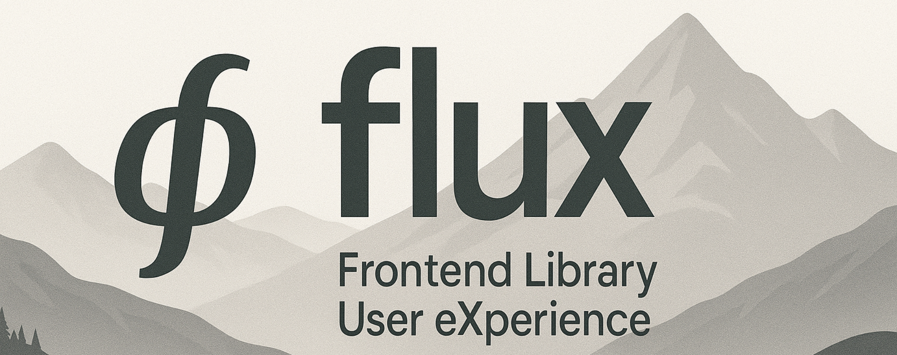

# FLUX

## Inhoudstafel

- 🚀 [Project](#project)
- 📒 [Documentatie](#documentatie)
- 👥 [Ontwikkel Team](#ontwikkel-team)

## Project

Deze __monorepo__ bevat de ontwikkeling die gebeurd door het __flux-team__ (Frontend Library / User eXperience)
van [Departement Omgeving](https://omgeving.vlaanderen.be/), onderdeel van
de [Vlaamse Overheid](https://www.vlaanderen.be/).

## Documentatie

Het project wordt gedocumenteerd m.b.v. Storybook, er zijn 2 major versies beschikbaar:
 - de meest recente v2 documentatie vind je via [Storybook v2](https://milieuinfo.github.io/flux-builds/release-v2/latest/storybook)
 - de meest recente v1 documentatie vind je via [Storybook v1](https://milieuinfo.github.io/flux-builds/release-v1/latest/storybook)

## Ontwikkel Team

| Kris Speltincx                                                             | Karim Dehbi                                                            | Koen Buckinx                                                           |
|----------------------------------------------------------------------------|------------------------------------------------------------------------|------------------------------------------------------------------------|
|  |  |     |
| [kspeltix](https://github.com/kspeltix)                                    | [Goldflow](https://github.com/Goldflow)                                | [k-o-e-n](https://github.com/k-o-e-n)                                  |
